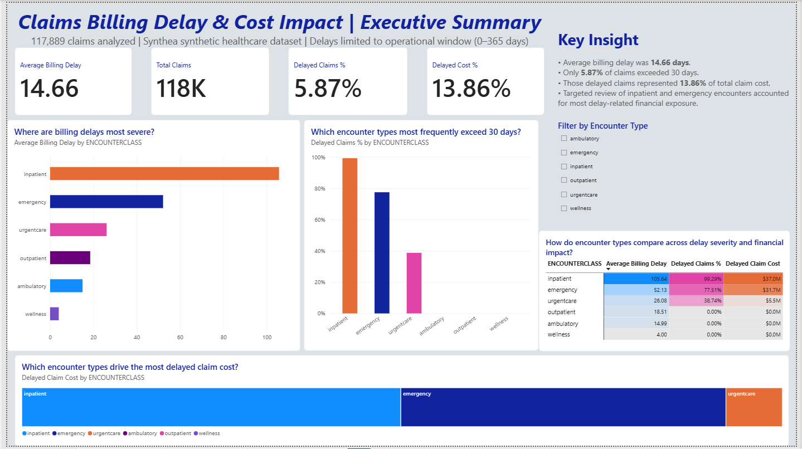
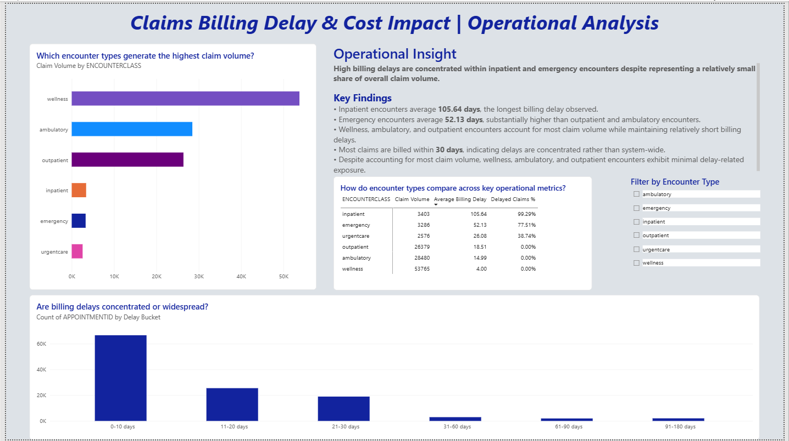
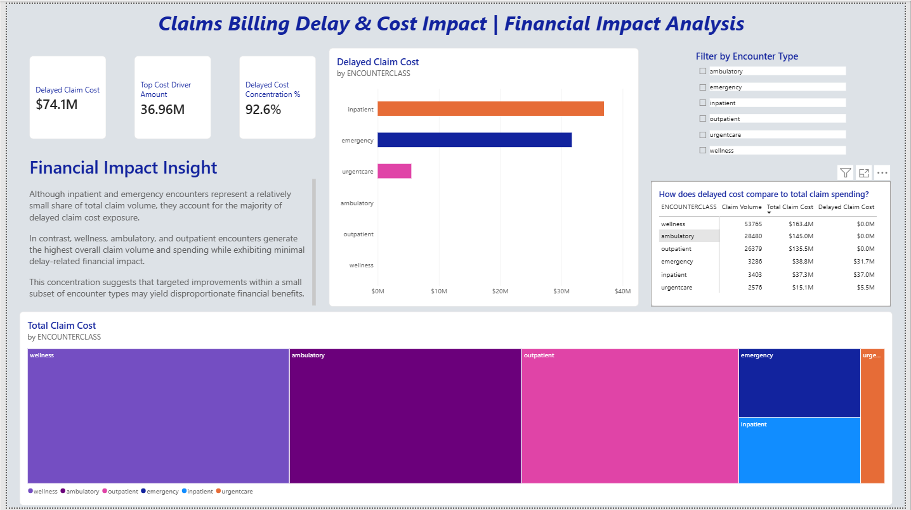

# Billing Cycle Delay & Cost Impact Analysis
### Project Repository ###
GitHub Repository: [View Project Files](https://github.com/shontelleQA/data-healthcare-analytics-suite/tree/main/billing-cycle-delay-cost-impact)


## Project Background & Business Problem

Timely claim billing is a critical component of healthcare revenue cycle operations. Delays between patient encounters and claim submission can reduce visibility into outstanding revenue, increase administrative workload, and create operational inefficiencies that impact financial performance.

This project analyzes billing cycle delays using synthetic healthcare claims and encounter data generated by Synthea. The objective is to measure the time between an encounter and the corresponding billing activity, identify which encounter types experience the longest delays, and determine whether delayed claims represent a meaningful share of overall claim cost.

By combining operational timing metrics with financial impact analysis, this project demonstrates how data can be used to identify workflow bottlenecks and prioritize areas for process improvement.


## Business Questions

- What is the average time between an encounter and claim billing?
- Which encounter types experience the longest billing delays?
- Do delayed claims represent a meaningful share of total claim cost?
- Which encounter types should be prioritized for operational review?


## Executive Summary

Analysis of healthcare claims and encounter records identified measurable billing delays concentrated within specific encounter types rather than across the entire claims process.

### Summary Results

- Average billing delay: **14.66 days**
- Claims delayed more than 30 days: **5.87%**
- Delayed claims represented **13.86%** of total claim cost
- Inpatient and emergency encounters represented a relatively small share of claim volume but accounted for approximately 92.6% of delayed claim cost exposure
- These findings suggest that billing delays are concentrated within specific encounter workflows rather than occurring across the entire claims operation.


## Data Overview

### Dataset

This analysis uses synthetic healthcare data generated by Synthea and loaded into Snowflake for querying and analysis.

The dataset included approximately:

- **180,000 encounter records**
- **117,889 claim records**

Claims were linked to encounters using appointment identifiers to analyze billing delay patterns, encounter characteristics, and claim cost impact.

### Join Validation

Join validation confirmed that all **117,889 claim records** successfully matched to encounter records and were included in the analysis.

### Tables Used

| Table | Purpose |
|---------|---------|
| CLAIMS | Billing dates and claim-level information |
| ENCOUNTERS | Encounter dates, encounter classification, and claim cost data |

### Join Logic

Claims were linked to encounters using the appointment identifier:

```sql
CLAIMS.APPOINTMENTID = ENCOUNTERS.ID
```

A join validation step was performed to confirm that claims successfully matched to encounter records before analysis was conducted.

### Key Fields

| Field | Description |
|---------|---------|
| START_DATE | Encounter start date |
| LASTBILLEDDATE1 | Date the claim was billed |
| ENCOUNTERCLASS | Encounter category (inpatient, emergency, outpatient, etc.) |
| TOTAL_CLAIM_COST | Total cost associated with the encounter |

### Core Metric

Billing delay was calculated as the number of days between the encounter date and claim billing date:

```sql
DATEDIFF('day', START_DATE, LASTBILLEDDATE1)
```

---


## Validation & Assumptions

### Data Validation

Several validation checks were performed before analysis:

- Reviewed source tables and field availability.
- Verified join integrity between CLAIMS and ENCOUNTERS.
- Confirmed successful matching of claims to encounter records.
- Calculated minimum, maximum, and average billing delays to identify anomalies.


### Operational Delay Window

To focus on realistic billing timelines, analysis was limited to delays between **0 and 365 days**.

Claims outside this range were excluded to prevent invalid or non-operational records from influencing results.


### Validation of Findings

Additional validation was performed on encounter-level delay patterns.

Encounter types showing no claims delayed beyond 30 days were reviewed separately to confirm results were caused by dataset characteristics rather than query errors.


### Assumptions & Limitations

- Data was generated using the Synthea synthetic healthcare dataset.
- Results are intended for analytical and portfolio purposes only.
- Billing workflows, payer behavior, and operational processes may differ from real healthcare organizations.
- Findings should be interpreted as illustrative examples of healthcare analytics techniques rather than real-world operational performance.


## Key Findings

### Billing Delay Distribution

- Average billing delay: **14.66 days**
- Most claims were billed within the operational window of 0–365 days.

### Delayed Claims and Cost Impact

- **5.87%** of claims exceeded the 30-day billing threshold.
- Those delayed claims represented **13.86%** of total claim cost.

### Encounter Types Driving Delay

- Inpatient encounters experienced the highest average billing delays.
- Emergency encounters experienced the second-highest average billing delays.
- Wellness encounters experienced the shortest average delays.
- Inpatient and emergency encounters accounted for approximately 92.6% of delayed claim cost exposure.
- High-cost billing delays were concentrated within a small subset of encounter types despite most claim volume occurring in wellness, ambulatory, and outpatient encounters.

### Encounter Types Driving Delayed Cost

- Inpatient and emergency encounters accounted for the majority of delayed claim cost.
- These encounter types represented the greatest concentration of delay-related financial exposure.

### Validation Results

- Outpatient, ambulatory, and wellness encounters showed little to no delays beyond 30 days.
- Validation checks confirmed this was a characteristic of the source dataset rather than a query issue.


## Recommendations

| Area | Recommendation | Expected Outcome |
|--------|--------|--------|
| Claims Operations | Review inpatient billing workflows to identify sources of delayed claim submission. | Reduced billing cycle times and fewer high-cost delayed claims. |
| Claims Operations | Evaluate emergency encounter billing processes for workflow bottlenecks. | Improved claim turnaround and revenue visibility. |
| Finance | Monitor claims exceeding 30 days as a recurring operational KPI. | Earlier identification of billing delays and financial exposure. |
| Leadership | Prioritize process improvement efforts in encounter types with the highest delay rates and costs. | Greater operational efficiency and reduced revenue cycle risk. |


## KPI Summary

| KPI | Result |
|---------|---------|
| Average Billing Delay | 14.66 days |
| Claims Delayed > 30 Days | 5.87% |
| Cost Associated with Delayed Claims | 13.86% |
| Highest Average Delay | Inpatient Encounters |
| Second Highest Average Delay | Emergency Encounters |
| Primary Cost Drivers | Inpatient and Emergency Encounters |


## Dashboard Preview

### Executive Summary



### Operational Analysis



### Financial Impact Analysis


---

## Technical Appendix

### Tools Used

- Snowflake
- SQL
- Power BI
- GitHub

### Analysis Workflow

1. Validate source data and record counts.
2. Verify join integrity between CLAIMS and ENCOUNTERS.
3. Calculate billing delay using encounter and billing dates.
4. Apply operational delay window (0–365 days).
5. Analyze delay distribution and cost impact.
6. Evaluate delay patterns by encounter type.
7. Validate findings and investigate anomalies.


### Repository Contents

- SQL analysis workflow
- Individual SQL scripts
- Power BI dashboard files
- Dashboard screenshots
- Dashboard documentation
- Source data files


### Metric Definitions

**Billing Delay (Days)**

```sql
DATEDIFF('day', START_DATE, LASTBILLEDDATE1)
```

**Long-Delay Claim**

A claim with a billing delay greater than 30 days.

**Delayed Claim Cost Percentage**

```sql
Delayed Claim Cost / Total Claim Cost
```

Used to quantify the financial impact of delayed billing activity.