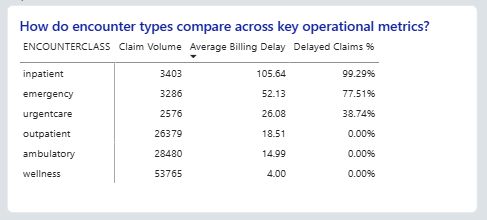

# Case Study: Identifying Concentrated Billing Delay Risk in Healthcare Claims Operations
**Tools Used:** Snowflake, SQL, Power BI

**Dataset:** 117,889 synthetic healthcare claims linked to encounter records

**Objective:** Identify billing delay patterns and determine whether delayed claims represent meaningful operational and financial risk.
## Executive Summary
A review of 117,889 healthcare claims was conducted to evaluate billing timeliness and identify areas of potential operational risk within the claims billing process. The analysis measured the number of days between patient encounters and claim billing activity, assessed the frequency of delayed claims, and evaluated the financial impact associated with billing delays.

Overall billing performance appeared stable, with an average billing delay of 14.66 days and only 5.87% of claims exceeding a 30-day billing threshold. However, those delayed claims accounted for 13.86% of total claim cost, indicating that a relatively small portion of claims represented a disproportionate share of delay-related financial exposure.

Further analysis revealed that inpatient and emergency encounters were responsible for approximately 92.6% of delayed claim cost exposure despite representing a relatively small share of total claim volume. These findings suggest that billing delays are concentrated within specific encounter workflows rather than occurring across the broader claims operation. As a result, targeted operational review of inpatient and emergency billing processes may provide greater value than organization-wide process changes.

## Current State
Healthcare revenue cycle operations depend on the timely conversion of patient encounters into billable claims. Once a patient encounter is completed, clinical information must be documented, translated into a claim, submitted for billing, and ultimately processed by the payer.

### Simplified Claims Billing Process

```text
Patient Encounter
        ↓
Clinical Documentation
        ↓
Claim Creation
        ↓
Claim Billing
        ↓
Payer Processing
```

Timely claim billing is essential for maintaining revenue cycle performance, supporting financial forecasting, and providing visibility into expected reimbursement. Delays between an encounter and claim billing can increase the amount of outstanding revenue awaiting submission and may create additional administrative effort for billing and operations teams.

Prior to this analysis, limited visibility existed into where billing delays were occurring across encounter types and whether those delays represented a meaningful source of financial risk. As a result, leadership lacked the information necessary to determine whether billing delays were isolated to specific workflows or reflected a broader operational concern.

## Stakeholders

Several business and operational stakeholders have an interest in billing timeliness, revenue visibility, and the efficient processing of healthcare claims. Understanding stakeholder priorities helps ensure that process improvement efforts are aligned with operational and financial objectives.

| Stakeholder | Business Interest |
|-------------|-------------------|
| Revenue Cycle Manager | Improve billing timeliness and reduce aging claims. |
| Claims Operations Team | Reduce processing delays and improve workflow efficiency. |
| Finance Leadership | Improve visibility into expected revenue and financial exposure. |
| Operations Leadership | Identify workflow bottlenecks and prioritize process improvements. |

## Problem Statement

Timely claim billing is an important component of healthcare revenue cycle performance, yet organizations often have limited visibility into where billing delays occur and whether those delays create meaningful operational or financial risk.

Leadership lacked visibility into whether billing delays were occurring uniformly across claims operations or whether specific encounter types represented a disproportionate source of delay-related financial exposure. Without this information, it was difficult to determine where process improvement efforts should be focused or whether delays reflected isolated workflow issues versus a broader operational concern.

The objective of this analysis was to measure billing delay performance, identify encounter types with elevated delay risk, and determine whether delayed claims represented a meaningful share of total claim cost exposure.

## Evidence from Analysis

Analysis was performed on 117,889 healthcare claims linked to encounter records to evaluate billing timeliness, identify patterns in delayed claim activity, and assess the financial impact associated with billing delays.

### Finding 1: Overall Billing Performance Was Stable

The analysis found an average billing delay of **14.66 days** across all claims. Additionally, only **5.87%** of claims exceeded the established 30-day billing threshold.

These results suggest that most claims were billed within expected operational timelines and that widespread billing delays were not present across the overall claims process.


*Figure 1. Executive summary metrics showing average billing delay, delayed claim percentage, and key performance indicators.*

---

### Finding 2: Delays Were Concentrated Rather Than System-Wide

Although a small percentage of claims exceeded the 30-day threshold, delay exposure was not evenly distributed across encounter types.

Validation analysis showed that outpatient, ambulatory, and wellness encounters experienced little to no delay exposure beyond 30 days. This indicates that billing delays were concentrated within specific workflows rather than representing a system-wide operational issue.

These findings suggest that broad process changes may be less effective than targeted improvements focused on high-risk encounter categories.


*Figure 2. Operational analysis showing billing delay patterns by encounter type.*

---

### Finding 3: Inpatient and Emergency Encounters Drove Delay Exposure

Significant differences were observed when billing performance was evaluated by encounter type.

- Inpatient encounters had the highest average billing delay at **105.64 days**.
- Emergency encounters had the second-highest average billing delay at **52.13 days**.
- Wellness encounters had the shortest average billing delay at **4.00 days**.

The concentration of delays within inpatient and emergency encounters indicates that billing performance varies substantially across encounter workflows.

These results suggest that operational review efforts should prioritize the encounter categories experiencing the greatest delay exposure.



*Figure 3. Encounter-level billing delay comparison.*

---

### Finding 4: Financial Risk Was Concentrated Within the Same Encounter Types

While only **5.87%** of claims exceeded the 30-day threshold, those claims accounted for **13.86%** of total claim cost.

Further analysis revealed that inpatient and emergency encounters represented approximately **92.6%** of all delayed claim cost exposure.

This finding demonstrates that a relatively small subset of delayed claims contributed disproportionately to potential financial risk. The concentration of both delay frequency and delayed claim cost within the same encounter types suggests that targeted process improvements may produce greater operational value than organization-wide initiatives.


*Figure 4. Financial impact of delayed claims by encounter type.*


## Root Cause Analysis
### Potential Contributing Factors

The analysis identified a significant concentration of billing delays within inpatient and emergency encounters. However, the available data does not provide sufficient information to determine the exact operational causes of those delays.

While root causes cannot be confirmed from claims and encounter data alone, several factors may contribute to the elevated delays observed within these encounter types:

### Additional Clinical Documentation Requirements

Inpatient and emergency encounters often involve more extensive clinical documentation than routine outpatient services. Additional documentation requirements may increase the time required before claims can be finalized and submitted for billing.

### Encounter Complexity

Higher-acuity encounters frequently involve multiple services, providers, procedures, and supporting documentation. This complexity may create additional steps within the billing process compared to lower-complexity encounter types.

### Billing Workflow Differences

Healthcare organizations may utilize different billing workflows based on encounter type. Specialized review processes, coding requirements, or encounter-specific billing procedures could contribute to longer billing timelines for inpatient and emergency services.

### Review and Approval Processes

Certain encounters may require additional clinical, coding, or compliance review before claim submission. These review activities may extend the time between encounter completion and billing activity.

### Key Observation

Although the specific causes of delay cannot be confirmed from the available data, the findings indicate that billing delays are concentrated within a limited number of encounter types rather than occurring across the broader claims operation. This suggests that targeted workflow analysis of inpatient and emergency billing processes may provide greater value than organization-wide process reviews.


## Recommendations

Based on the findings, targeted process improvement efforts are recommended for the encounter types responsible for the majority of delay-related financial exposure. Because billing delays were concentrated within specific workflows rather than occurring across the broader claims operation, focused interventions are likely to provide greater value than organization-wide process changes.

| Recommendation | Supporting Evidence | Expected Benefit |
|---------------|---------------------|------------------|
| Prioritize review of inpatient billing workflows | Inpatient encounters experienced the highest average billing delay (105.64 days) and represented a significant share of delayed claim cost exposure. | Reduced billing delays and improved revenue cycle performance. |
| Evaluate emergency encounter billing processes | Emergency encounters had the second-highest average billing delay (52.13 days) and contributed substantially to delayed claim cost exposure. | Improved claim submission timeliness and reduced financial risk. |
| Monitor claims exceeding 30 days as an operational KPI | Claims delayed beyond 30 days represented only 5.87% of claims but accounted for 13.86% of total claim cost. | Earlier identification of high-risk claims and potential workflow issues. |
| Implement billing timeliness dashboard reporting | Limited visibility existed into where delays were occurring across encounter types. | Improved operational oversight and data-driven decision-making. |

These recommendations focus on the encounter types and claim populations associated with the greatest delay-related financial exposure. By concentrating improvement efforts on the areas identified through analysis, organizations can more effectively allocate resources and reduce operational risk.

## Expected Business Impact

The findings indicate that billing delays are concentrated within a limited number of encounter types rather than occurring across the broader claims operation. As a result, targeted improvement efforts may provide greater operational value than organization-wide process changes.

| Action | Expected Outcome |
|----------|------------------|
| Targeted workflow reviews | Reduced billing delays within high-risk encounter categories. |
| KPI monitoring for claims exceeding 30 days | Earlier identification of billing issues and operational bottlenecks. |
| Focused process improvement initiatives | More efficient allocation of operational resources. |
| Reduction in delayed claim exposure | Improved visibility into expected revenue and financial performance. |
| Enhanced billing performance reporting | Better decision-making through increased operational transparency. |

By focusing on inpatient and emergency encounter workflows, organizations can prioritize improvement efforts where delay-related financial exposure is most heavily concentrated. This targeted approach may help reduce billing cycle times, improve revenue visibility, and strengthen overall revenue cycle performance while avoiding unnecessary changes to workflows that are already performing effectively.


## Key Takeaway

Although overall billing performance appeared stable, analysis revealed that delay-related financial exposure was concentrated within inpatient and emergency encounter workflows. By focusing improvement efforts on these high-risk areas, healthcare organizations may achieve greater operational impact than through broad process changes applied across all encounter types.